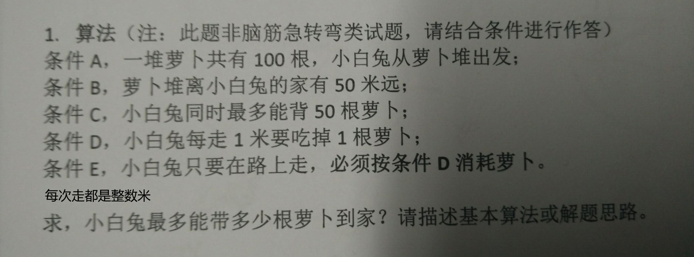

# [语法图（铁路图）的解析实现](https://github.com/laomu1988/railroad-diagram)
> 使用js分析简单的数学算式

# 编辑器中当前内容及替换内容

# gulp-riot-css中媒体选择器bug及css格式化

# 算法题:兔子和萝卜
>  
    原题： 
    另外： 假如是200根萝卜结果是多少呢？假如是任意根萝卜结果是多少？

# 算法题：有一个数组，里面的数除了其中一个只出现一次外，其他的数都出现了两次。找出这个数。
>  要求时间复杂度O(n),空间复杂度O(1)


# nodejs中一个文件引入另一个文件,计算新的文件位置
```
var newPath = path.join(oldFile.base, src);
```